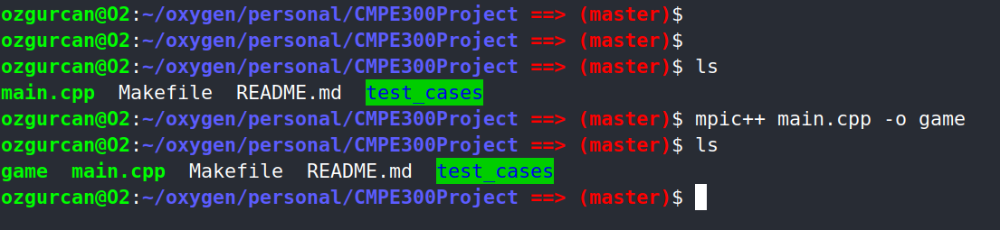
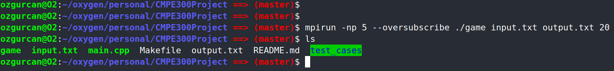
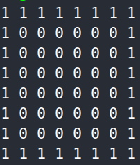
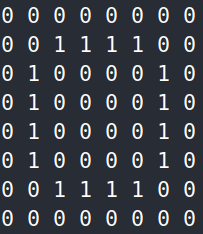
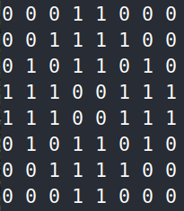
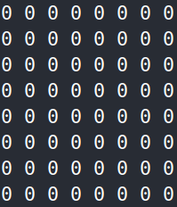
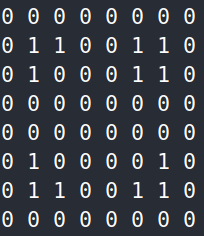
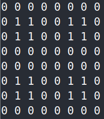

# CMPE 300 ANALYSIS OF ALGORITHMS TERM PROJECT
- ### Written by İ. ÖZGÜRCAN ÖZTAŞ
- ### Submitted to TUNGA GÜNGÖR
- ### Project Name: Parallel Game of Life
- ### Project Type: Programming Project
- ### Submission Date: 20.12.2019

<div style="page-break-after: always;"></div>

## Introduction
- This project is given to understand and apply the concepts of parallel algorithms and how those algorithms proceed when constructed. The aspects of the problem defined in project description is that there is a game called Game of Life, composed by John Horton Conway, which is a cellular automaton (If needed, click [here](https://en.wikipedia.org/wiki/Cellular_automaton) to understand cellular automaton). At each state, with the data of current state, next state is decided. On top of that, this project aims to make Game of Life executed in parallel, mostly.

- To reach out a parallel solution, I used MPI(Message Passing Interface) to distribute the workload of a sequential algorithm into paralellized part and a sequential part.

    - The sequential part in my solution executes several keyparts, namely input read, create the main grid(2D Matrix), distribute each subgrid to its related process, collect output from each process and write output.

    - The parallel part is evaluating next step with the data of current state.

- There's several terms I want to conclude here and use after if necessary.
    
    - Master: "Process 0", "Main Process"
    - Slave: Each of the remaining processes, "Sub Process"

## Program Interface

- There is no GUI(Graphical User Interface) for the project at the moment, hence the current interface is selected as commandline (cmd, bash).
- For this program to work properly in your platform, there are several steps to be done before program execution.

    - This project is based on *NIX environment and its package providers, hence there will be no Windows or another operating system environment guideline.
    - Open a terminal and type those commands in the given order.

        1- Check if there's any update in your system.
        ```
        sudo apt-get update
        ```
        2- If so, install those updates.
        ```
        sudo apt-get -y upgrade
        ```
        3- After those pre-requirements, continue with main environmental needs. C and C++ compilers, and non-interactive network downloader(GCC, G++, wget) should be installed. If the command won't work, replace apt with 'apt-get'.
        ```
        sudo apt install gcc g++ wget
        ```
        4- Install MPI environment from the opensource platform.
        ```
        wget https://download.open-mpi.org/release/open-mpi/v4.0/openmpi-4.0.2.tar.gz
        ```
        5- Extract the files with gunzip.
        ```
        gunzip -c openmpi-4.0.2.tar.gz | tar xf -
        ```
        6- Now, change directory into the OpenMPI folder.
        ```
        cd openmpi-4.0.2
        ```
        7- Set the configuration within the folder "/usr/local".
        ```
        sudo ./configure --prefix=/usr/local; sudo ldconfig
        ```
        8- Finally, unload all packages into the system.
        ```
        sudo make all install
        ```

- This sequence of commands is necessary to execute the project properly.

## Program Execution Phase 1

- Clone the project from Github repository.
    ```
    git clone https://github.com/oztasozgurcan/CMPE300Project.git
    ```
- Since the term is not finished, the repository will be private. After January 15, 2020 the project will be a part of open source projects.
- Change directory into the project.
    ```
    cd ./CMPE300Project
    ```
- There's the code, Makefile, README.md and 'test_cases' for the project. Test cases include 1 example input and several outputs of different iterations.

## Program Execution Phase 2

### Compile (Build)
- Execute the command below to compile the project code.
```
mpic++ main.cpp -o game
```

### Execute (Deploy)
- Currently supported input types: [.txt]
- Currently supported output types: [.txt]
- Functionality of the project: Simulate cellular automaton
- The executable program is named "game". Several parameters should be set when execute.
```
mpirun [-np <number_of_parameters>] [--oversubscribe <allow_overprocessing>] <executable_name> <input_file> <output_file> <number_of_iterations>
```

- [-np] sets the number of processes. If it's greater than the default amount of processes, it'll give an error.
- [--oversubscribe] allows greater number of processes in the system. If set, then it handles the error described in previous explanation.
- <executable_name> is the name of executable. In this project, it is "./game".
- <input_file> is the name of input file.
- <output_file> is the name of output file.
- <number_of_iterations> is the desired amount of iterations.

- Example execution:
```
mpirun -np 17 --oversubscribe ./game input.txt output.txt 20
```

### Screen Outputs of Compile And Execution

- Compile Screen Output:



- Execution Screen Output:



## Input and Output

- Input files are regular-text(.txt) documents.
- Output files are regular-text(.txt) documents.
- Example input-output files are given in test_cases folder.

### Screen Outputs of I/O Files:

- Input File Screen Output:

    

- Output File Screen Output:

    

## Program Structure

- This program has one class, which is Sliceable. This class has several class fields and class methods.
    - Class fields:
        - Private fields:
            - char* infile
            - char* outfile
        
        - Public fields:
            - int grid[360][360]

    - Class methods:
        - static int convert(char c)
            - Converts input character into 0 or 1.

            - ASCII value of character 0 = 48

            - ASCII value of character 1 = 49

        - void setInfile(char* in)
            - Set the inputfile of the project with the given char array.
        - void setOutfile(char* out)
            - Set the outputfile of the project with the given char array.
        - void setGrid()
            - Sets the whole grid with the input provided in inputfile.
        - void writeGrid()
            - Prints out the current grid into the provided output file.

- In main function, MPI is initialized and some variables are declared and assigned.
    - int err: It is the return value of each MPI_Send() or MPI_Recv() function.

    - int processor: It is the number of process declared in Command-Line-Interface(CLI).

    - int rank: It is the rank of each process.

- For rank==0, the master process, there are several variables declared and assigned.
    - int check: The size of the one dimension of checkerboard.
        - It is found by function check(p) = (int)sqrt(p - 1)

        - Since process 0 is master, it is not in checkerboard. The rest composes the checkerboard as an abstract manner, and its dimension is the square root of (p-1).
    
    - int slaveX: Dimension of each subgrid in each slave.
        - It is found by function slaveX(p) = 360 / (int)check(p)

        - Since the dimension of whole grid is determined in project description, it is written as 360.
    
    - Sliceable toroid(): The main grid object with several features.
        - Its fields and functions are explained above.

    - After several declarations, project gets input_file and output_file locations. sets its first state grid and sends the distinct subgrids to slaves with its corresponding frame.
        - There will be further explanations in code as a block comment.

    - Therefore, master waits slaves to execute their jobs. When slaves finish their jobs, they send the output data to master and master puts each output_data to its proper position. Furthermore, master reaches to its final phase.
        - This is regulated with the tag option in MPI_Send() and MPI_Recv().

    - At final phase, writing into file method is called and the output is written into the output_file.

- For rank > 0, the slaves, there are several phases to get the right output of each iteration.

    - In first phase, several declarations have been made.

        - int check: Similar to 'check' in master.

        - int size: Similar to 'slaveX' in master, yet it is bigger than 'slaveX' by 2.

            - Since slaves receives the subgrid with its frame, it has to have a exact value of n + 2, where n is the dimension of subgrid.

        - int before[size][size]: It is the subgrid with frame. It has the previous state of the iteration.

        - int after[size-2][size-2]: It is the after state of iteration. Iteration details will be given in further parts.

        - int iterations: Number of desired iterations, given as a command-line input, argument number 4.

    - In second phase, the iteration task begin for each process.

        - Every turn, for each position in subgrid, the env_resources is calculated and the decisions are made based on its value.

            - int env_resources: Summation of all neighbours of each position in subgrid, without the frame.

            - Hence, although the dimension of before grid is n + 2, the dimension of after grid is n.
        - Decisions are explained in project description.

        - After the iteration, the results are written in the subgrid part of before. That aims to have necessary values for next iteration.

    - In third phase, the frame around subgrid is reconstructed with the values of adjacent neighbours.

        - A frame consists of 2 parts: Corners and borders.

        - Both of them are collected by the adjacent neighbours.
        - For this intercommunication among slaves to work, there has to be no deadlock at every communication step.

            - To achieve such stable state, at each communication, half of the slaves send the data and the other half receives it.

                - There's inline comments on each if statement that decides which half does what operations.

            - To make it more stable, each communication has its tag along with it.
            - By using 4 tags, slaves can separate their communication into 4 different parts and each time, slaves sends data according to their tag value.

                - Tag values: 1, 2, 3, 4
     
    - In fourth phase, slaves sends their data to the one and only master, which has the feature to combine separated data into one whole grid. 

- The logic is simply divide and conquer for the project. There's sequential and parallel workload and for parallel part, MPI_Send() and MPI_Recv() functions are used.
    
    - MPI_Send(const void* buffer, int count, MPI_Datatype datatype, int dest, int tag, MPI_Comm comm)

        - const void* buffer: Buffer that holds the data which is ready to be sent.

        - int count: # of data that should be send. 

        - MPI_Datatype: Type of sent data.

        - int dest: Rank of the destination process.

        - int tag: Tag ID.

        - MPI_Comm comm: The communication medium among processes.

    - MPI_Recv(const void* buffer, int count, MPI_Datatype datatype, int dest, int tag, MPI_Comm comm, MPI_Status *status)

        - const void* buffer: Buffer that holds the data which is ready to be sent.

        - int count: # of data that should be send.

        - MPI_Datatype: Type of sent data.

        - int dest: Rank of the destination process.

        - int tag: Tag ID.

        - MPI_Comm comm: The communication medium among processes.

        - MPI_Status *status: The status after receive operation, wheter it is successful or not.

## Examples

- The section below explains 3 iterations of an example input.
    - Example input:

        
    - First iteration:

        
    - Second iteration:

        
    - Third, the final, iteration:

        

- The section below explains 3 iterations of an example input.
    - Example input:

        
    - First iteration:

        
    - Second iteration:

        
    - Third, the final, iteration:

        

## Improvements and Extensions

- Future Improvements:

    - A GUI will be added to transform the project from a simulation engine to a complete simulator.

    - Infrastructure will be generalized to make project more generic.

    - A web application of the engine will be composed.

    - The project will be containerized via Docker to avoid environment settings.

- Weak spots:

    - Fixed size of the grid makes in non-generic.

    - Number of if statements are too much. It can be reduced into a simple and generic manner.

    - Since no GUI appears when executed, checking the project output can be a challenging matter.

- Deviations of the coding part:

    - Due to limited time of the coder, composing structural send/receive operations are avoided to be done. It will change within next weeks.

## Difficulties Encountered

- Main hardship is checking each position described in if statements whether it is correct or not. If it were not correct, it would lead either a deadlock, which is a disaster, or wrong output.

- To avoid such cases, I've checked so many times of the positions, yet there was one case that made me delay 12 hours.

## Conclusion

- It was a challenging, yet a fun project to compose. I've learned general information about cellular automaton and how it works. By doing it in parallel manner, I've interested in parallelizing such sequential problems.

- For another project, I would likely to use C++ as a programming language, since I'm confident to code with C++. 

## Appendices

```
#include <mpi.h>
#include <iostream>
#include <fstream>
#include <vector>
#include <math.h>

using namespace std;

class Sliceable {
    
    private:
    char *infile;
    char *outfile;

    public:
    int grid[360][360];
    Sliceable(){
        infile = nullptr;
        outfile = nullptr;
    }

    static int convert(char c){
        return c - 48;
    }

    void setInfile(char *in){
        this->infile = in;
    }

    char* getInfile(){
        return this->infile;
    }

    void setOutfile(char *out){
        this->outfile = out;
    }

    char* getOutfile(){
        return this->outfile;
    }

    void setGrid(){
        ifstream ifs(infile, ifstream::in);
        
        int rowPosition, columnPosition;
        rowPosition = 0; columnPosition = 0;
        char c;
        
        do{
            if(columnPosition == 360){
                ifs.clear();
                rowPosition++;
                columnPosition = 0;
            }

            c = ifs.get();

            if(c == 48 || c == 49){
                this->grid[rowPosition][columnPosition] = Sliceable::convert(c);
                columnPosition++;
            }
            else {
                continue;
            }
        }
        while(!ifs.eof());
    }

    void writeGrid(){
        ofstream ofs(outfile, ofstream::out);
        for(int i=0; i<360; i++){
            for(int j=0; j<360; j++){
                ofs << this->grid[i][j] << " ";
            }
            ofs << "\n";
            ofs.flush();
        }
        ofs.close();
    }
};

int main(int argc, char *argv[]){

    if(argc != 4){
        printf("Invalid amount of parameters. Aborted\n");
    }
    
    int err, processor, rank;

    err = MPI_Init(&argc, &argv);
    err = MPI_Comm_size(MPI_COMM_WORLD, &processor);
    err = MPI_Comm_rank(MPI_COMM_WORLD, &rank);

    if(rank == 0){
        int check = (int)sqrt(processor - 1);
        int slaveX = 360 / check;
        MPI_Status status;

        Sliceable *toroid = new Sliceable();
        (*toroid).setInfile(argv[1]);
        (*toroid).setOutfile(argv[2]);

        (*toroid).setGrid();
        /*
        - I split the grid into (p-1) subgrids to distribute in slave processes.
        - And for ease of use, I send the frame that surrounds each subgrid.
        - e.g. if subgrid has n*n matrix, I send (n+2)*(n+2) to slave processes to execute first iteration without any intercommunication.
        - Since grid is in a shape of toroid, for border cases there has to be a connection between borders and their neighbours on toroid. Since toroid connects borders periodically, I put modulus to avoid reaching out invalid index on grid.
            - e.g. if i = -1: since there's no -1 index on grid, it should be 360 - 1 = 359.

        Variables 'latitude' and 'longitude' represent location of each element inside the grid, based on the process rank. Each process will receive its own subgrid data depending on its rank.

        e.g. For p = 5;
        
        | 1 0 1 0 |
        | 1 0 0 1 |
        | 0 0 0 1 |
        | 1 1 0 0 |
        
        This grid will divide into four subgrids:
        p == 1 => [[1, 0], [1, 0]]; latitude = (((1-1)/2)*(4/2))-1 = -1; 
                                    longitude = (((1-1)%2)*(4/2))-1 = -1;
        p == 2 => [[1, 0], [0, 1]]; latitude = (((2-1)/2)*(4/2))-1 = -1;
                                    longitude = (((2-1)%2)*(4/2))-1 = 1;
        p == 3 => [[0, 0], [1, 1]]; latitude = (((3-1)/2)*(4/2))-1 = 1;
                                    longitude = (((3-1)%2)*(4/2))-1 = -1;
        p == 4 => [[0, 1], [0, 0]]; latitude = (((4-1)/2)*(4/2))-1 = 1;
                                    longitude = (((4-1)%2)*(4/2))-1 = 1;
        Those values are starting indexes for each process's subgrid. 
        Master process send data to slave processes related to their subgrid.

        - 'check' is the dimension of checker board. 
            ==> processor = check * check + 1;
                - '+1' for the master process.
        - 'slaveX' is the dimension of each process's subgrid.
            ==> slaveX = (int)sqrt(processor - 1); 
                - In project, we have precise dimensions, 360*360. Hence,
                - e.g. For p = 17, check = 4, slaveX = 90.
                - e.g. For p = 65, check = 8, slaveX = 45.
                - e.g. For p = 145, check = 12, slaveX = 30.
        */

        int latitude, longitude;
        for(int p=1; p<processor; p++){
            latitude = (((p-1)/check)*slaveX);
            longitude = (((p-1)%check)*slaveX);
            for(int i=latitude-1; i<latitude+slaveX+1; i++){
                for(int j=longitude-1; j<longitude+slaveX+1; j++){
                    err = MPI_Send(&toroid->grid[(i+360)%360][(j+360)%360], 1, MPI_INT, p, p, MPI_COMM_WORLD);
                }
            }
        }

        /*
        I retrieve data from slave processes based on the tag. Each slave send its tag while sending data to master, hence data is not shuffled among slaves while master is retrieving data.
        */

        for(int p=1; p<processor; p++){
            for(int i=(((p-1)/check)*slaveX); i<((((p-1)/check)+1)*slaveX); i++){
                for(int j=(((p-1)%check)*slaveX); j<((((p-1)%check)+1)*slaveX); j++){
                    err = MPI_Recv(&toroid->grid[i][j], 1, MPI_INT, p, p, MPI_COMM_WORLD, &status);
                }
            }
        }

        /*
        Call write-to-file method of class Sliceable.
        */

        (*toroid).writeGrid();
        
        MPI_Finalize();
    }
    else {
        int check = (int)sqrt(processor - 1);
        int size = (360 / check) + 2;
        // int arr[size*size];
        // Previous state of iteration.
        int before[size][size];
        // Next state after iteration.
        int after[size-2][size-2];
        MPI_Status status;

        for(int i=0; i<size; i++){
            for(int j=0; j<size; j++){
               err = MPI_Recv(&before[i][j], 1, MPI_INT, 0, rank, MPI_COMM_WORLD, &status);
            }
        }

        // for(int i=0; i<size; i++){
        //     for(int j=0; j<size; j++){
        //         before[i][j] = arr[size*i+j];
        //     }
        // }
        
        int iterations = stoi(argv[3]);
        for(int turn=0; turn<iterations; turn++){
            for(int i=1; i<size-1; i++){
                for(int j=1; j<size-1; j++){
                    
                    int env_resources = (before[i-1][j-1] + before[i][j-1] + before[i+1][j-1] + before[i-1][j] + before[i+1][j] + before[i-1][j+1] + before[i][j+1] + before[i+1][j+1]);

                    if(before[i][j] == 1){
                        if(env_resources < 2){
                            after[i-1][j-1] = 0;
                        }
                        else if(env_resources > 3){
                            after[i-1][j-1] = 0;
                        }
                        else
                        {
                            after[i-1][j-1] = 1;
                        }
                    }
                    else
                    {
                        if(env_resources == 3){
                            after[i-1][j-1] = 1;
                        }
                        else
                        {
                            after[i-1][j-1] = 0;
                        }
                    }
                }
            }

            // After iterations, put the current state data to previous state grid.
            // To be used in next iteration.
            for(int i=1; i<size-1; i++){
                for(int j=1; j<size-1; j++){
                    before[i][j] = after[i-1][j-1];
                }
            }
            // After then, communication begins. Each case is explicitly written below.
            // It can be rearranged into generic if cases, since the communication tags are distinctive.

            // Odd Sends the right column
            if(rank%2==1){
                for(int i=0; i<size-2;i++){
                    err = MPI_Send(&after[i][size-3], 1, MPI_INT, rank+1, 1, MPI_COMM_WORLD);
                }
            }
            
            // Even Receives the left column.
            if(rank%2==0){
                for(int i=0; i<size-2; i++){
                    err = MPI_Recv(&before[i+1][0], 1, MPI_INT, rank-1, 1, MPI_COMM_WORLD, &status);
                }
            }

            // Odd Sends the left column.
            if(rank%2==1){
                int dest = rank - 1;
                if(dest%check == 0){
                    dest = dest + check;
                }
                for(int i=0; i<size-2; i++){
                    err = MPI_Send(&after[i][0], 1, MPI_INT, dest, 2, MPI_COMM_WORLD);
                }
            }

            // Even Receives the right column.
            if(rank%2==0){
                int dest = rank + 1;
                if(dest % check == 1){
                    dest = dest - check;
                }
                for(int i=0; i<size-2; i++){
                    err = MPI_Recv(&before[i+1][size-1], 1, MPI_INT, dest, 2, MPI_COMM_WORLD, &status);
                }
            }

            // Even Sends the left column.
            if(rank%2==0){
                for(int i=0; i<size-2; i++){
                    err = MPI_Send(&after[i][0], 1, MPI_INT, rank-1, 3, MPI_COMM_WORLD);
                }
            }

            // Odd Receives the right column.
            if(rank%2==1){
                for(int i=0; i<size-2; i++){
                    err = MPI_Recv(&before[i+1][size-1], 1, MPI_INT, rank+1, 3, MPI_COMM_WORLD, &status);
                }
            }

            // Even Sends the right column.
            if(rank%2==0){
                int dest = rank + 1;
                if(dest%check==1){
                    dest = dest - check;
                }
                for(int i=0; i<size-2; i++){
                    err = MPI_Send(&after[i][size-3], 1, MPI_INT, dest, 4, MPI_COMM_WORLD);
                }
            }

            // Odd Receives the left column.
            if(rank%2==1){
                int dest = rank - 1;
                if(dest%check==0){
                    dest = dest + check;
                }
                for(int i=0; i<size-2; i++){
                    err = MPI_Recv(&before[i+1][0], 1, MPI_INT, dest, 4, MPI_COMM_WORLD, &status);
                }
            }

            // Odd Sends the bottom row.
            if(((rank-1)/check)%2==1){
                int dest = rank + check;
                if(dest > (processor - 1)){
                    dest = dest - (processor - 1);
                }
                for(int i=0; i<size-2; i++){
                    err = MPI_Send(&after[size-3][i], 1, MPI_INT, dest, 1, MPI_COMM_WORLD);
                }
            }

            // Even Receives the top row.
            if(((rank-1)/check)%2==0){
                int dest = rank - check;
                if(dest < 1){
                    dest = dest + (processor - 1);
                }
                for(int i=0; i<size-2; i++){
                    err = MPI_Recv(&before[0][i+1], 1, MPI_INT, dest, 1, MPI_COMM_WORLD, &status);
                }
            }

            // Odd Sends the top row.
            if(((rank-1)/check)%2==1){
                int dest = rank - check;
                for(int i=0; i<size-2; i++){
                    err = MPI_Send(&after[0][i], 1, MPI_INT, dest, 2, MPI_COMM_WORLD);
                }
            }

            // Even Receives the bottow row.
            if(((rank-1)/check)%2==0){
                int dest = rank + check;
                for(int i=0; i<size-2; i++){
                    err = MPI_Recv(&before[size-1][i+1], 1, MPI_INT, dest, 2, MPI_COMM_WORLD, &status);
                }
            }

            // Even Sends the bottom row.
            if(((rank-1)/check)%2==0){
                int dest = rank + check;
                for(int i=0; i<size-2; i++){
                    err = MPI_Send(&after[size-3][i], 1, MPI_INT, dest, 3, MPI_COMM_WORLD);
                }
            }

            // Odd Receives the top row.
            if(((rank-1)/check)%2==1){
                for(int i=0; i<size-2; i++){
                    err = MPI_Recv(&before[0][i+1], 1, MPI_INT, rank-check, 3, MPI_COMM_WORLD, &status);
                }
            }

            // Even Sends the top row.
            if(((rank-1)/check)%2==0){
                int dest = rank - check;
                if(dest < 1){
                    dest = dest + (processor - 1);
                }
                for(int i=0; i<size-2; i++){
                    err = MPI_Send(&after[0][i], 1, MPI_INT, dest, 4, MPI_COMM_WORLD);
                }
            }

            // Odd Receives the bottom row.
            if(((rank-1)/check)%2==1){
                int dest = rank + check;
                if(dest > (processor - 1)){
                    dest = dest - (processor - 1);
                }
                for(int i=0; i<size-2; i++){
                    err = MPI_Recv(&before[size-1][i+1], 1, MPI_INT, dest, 4, MPI_COMM_WORLD, &status);
                }
            }
            // TODO: Add diagonals.
            // Odd Sends the bottomright.
            if(rank%2==1){
                int dest = rank + (check + 1);
                if(dest > (processor - 1)){
                    dest = dest - (processor - 1);
                }
                err = MPI_Send(&after[size-3][size-3], 1, MPI_INT, dest, 1, MPI_COMM_WORLD);
            }

            // Even Receives the topleft.
            if(rank%2==0){
                int dest = rank - (check + 1);
                if(dest < 1){
                    dest = dest + (processor - 1);
                }
                err = MPI_Recv(&before[0][0], 1, MPI_INT, dest, 1, MPI_COMM_WORLD, &status);
            }

            // Odd Sends the bottomleft.
            if(rank%2==1){
                int dest = rank + (check - 1);
                if(rank%check==1){
                    dest = dest + check;
                }
                if(dest > (processor - 1)){
                    dest = dest - (processor - 1);
                }
                err = MPI_Send(&after[size-3][0], 1, MPI_INT, dest, 2, MPI_COMM_WORLD);
            }

            // Even Receives the topright.
            if(rank%2==0){
                int dest = rank - (check - 1);
                if(rank%check==0){
                    dest = dest - check;
                }
                if(dest < 1){
                    dest = dest + (processor - 1);
                }
                err = MPI_Recv(&before[0][size-1], 1, MPI_INT, dest, 2, MPI_COMM_WORLD, &status);
            }

            // Odd Sends the topleft.
            if(rank%2==1){
                int dest = rank - (check + 1);
                if(rank%check==1){
                    dest = dest + check;
                }
                if(dest > (processor - 1)){
                    dest = dest - (processor - 1);
                }
                if(dest < 1){
                    dest = dest + (processor - 1);
                }
                err = MPI_Send(&after[0][0], 1, MPI_INT, dest, 3, MPI_COMM_WORLD);
            }

            // Even Receives the bottomright.
            if(rank%2==0){
                int dest = rank + (check + 1);
                if(rank%check==0){
                    dest = dest - check;
                }
                if(dest > (processor - 1)){
                    dest = dest - (processor - 1);
                }
                if(dest < 1){
                    dest = dest + (processor - 1);
                }
                err = MPI_Recv(&before[size-1][size-1], 1, MPI_INT, dest, 3, MPI_COMM_WORLD, &status);
            }

            // Odd Sends the topright.
            if(rank%2==1){
                int dest = rank - (check - 1);
                if(dest < 1){
                    dest = dest + (processor - 1);
                }
                err = MPI_Send(&after[0][size-3], 1, MPI_INT, dest, 4, MPI_COMM_WORLD);
            }

            // Even Receives the bottomleft.
            if(rank%2==0){
                int dest = rank + (check - 1);
                if(dest > (processor - 1)){
                    dest = dest - (processor - 1);
                }
                err = MPI_Recv(&before[size-1][0], 1, MPI_INT, dest, 4, MPI_COMM_WORLD, &status);
            }

            // Even Sends the bottomleft.
            if(rank%2==0){
                int dest = rank + (check - 1);
                if(dest > (processor - 1)){
                    dest = dest - (processor - 1);
                }
                err = MPI_Send(&after[size-3][0], 1, MPI_INT, dest, 1, MPI_COMM_WORLD);
            }

            // Odd Receives the topright.
            if(rank%2==1){
                int dest = rank - (check - 1);
                if(dest < 1){
                    dest = dest + (processor - 1);
                }
                err = MPI_Recv(&before[0][size-1], 1, MPI_INT, dest, 1, MPI_COMM_WORLD, &status);
            }

            // Even Sends the bottomright.
            if(rank%2==0){
                int dest = rank + (check + 1);
                if(rank%check == 0){
                    dest = dest - check;
                }
                if(dest > (processor - 1)){
                    dest = dest - (processor - 1);
                }
                if(dest < 1){
                    dest = dest + (processor - 1);
                }
                err = MPI_Send(&after[size-3][size-3], 1, MPI_INT, dest, 2, MPI_COMM_WORLD);
            }

            // Odd Receives the topleft.
            if(rank%2==1){
                int dest = rank - (check + 1);
                if(rank%check==1){
                    dest = dest + check;
                }
                if(dest > (processor - 1)){
                    dest = dest - (processor - 1);
                }
                if(dest < 1){
                    dest = dest + (processor - 1);
                }
                err = MPI_Recv(&before[0][0], 1, MPI_INT, dest, 2, MPI_COMM_WORLD, &status);
            }

            // Even Sends the topleft.
            if(rank%2==0){
                int dest = rank - (check + 1);
                if(dest < 0){
                    dest = dest + (processor - 1);
                }
                err = MPI_Send(&after[0][0], 1, MPI_INT, dest, 3, MPI_COMM_WORLD);
            }

            // Odd Receives the bottomright.
            if(rank%2==1){
                int dest = rank + (check + 1);
                if(dest > (processor - 1)){
                    dest = dest - (processor - 1);
                }
                err = MPI_Recv(&before[size-1][size-1], 1, MPI_INT, dest, 3, MPI_COMM_WORLD, &status);
            }

            // Even Sends the topright.
            if(rank%2==0){
                int dest = rank - (check - 1);
                if(rank%check==0){
                    dest = dest - check;
                }
                if(dest < 1){
                    dest = dest + (processor - 1);
                }
                if(dest > (processor - 1)){
                    dest = dest - (processor - 1);
                }
                err = MPI_Send(&after[0][size-3], 1, MPI_INT, dest, 4, MPI_COMM_WORLD);
            }

            // Odd Receives the bottomleft.
            if(rank%2==1){
                int dest = rank + (check - 1);
                if(rank%check==1){
                    dest = dest + check;
                }
                if(dest > (processor - 1)){
                    dest = dest - (processor - 1);
                }
                if(dest < 1){
                    dest = dest + (processor - 1);
                }
                err = MPI_Recv(&before[size-1][0], 1, MPI_INT, dest, 4, MPI_COMM_WORLD, &status);
            }
        }

        // Sends the information to the master.
        // If there's no iteration, the previous state will be output.
        // Else, the result grid of iterations will be sent.
        if(iterations == 0){
            for(int i=0; i<size-2; i++){
                for(int j=0; j<size-2; j++){
                    err = MPI_Send(&before[i+1][j+1], 1, MPI_INT, 0, rank, MPI_COMM_WORLD);
                }
            }
        }
        else {
            for(int i=0; i<size-2; i++){
                for(int j=0; j<size-2; j++){
                    err = MPI_Send(&after[i][j], 1, MPI_INT, 0, rank, MPI_COMM_WORLD);
                }
            }
        }
        
        err = MPI_Finalize();
    }
}
```
