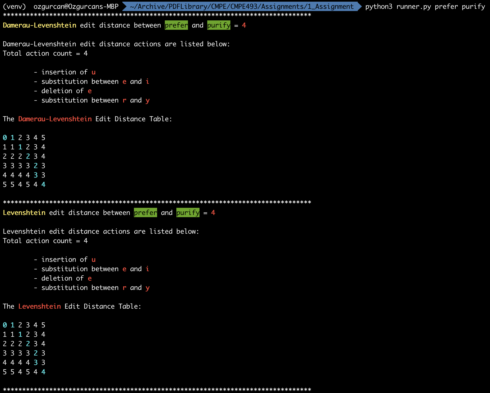
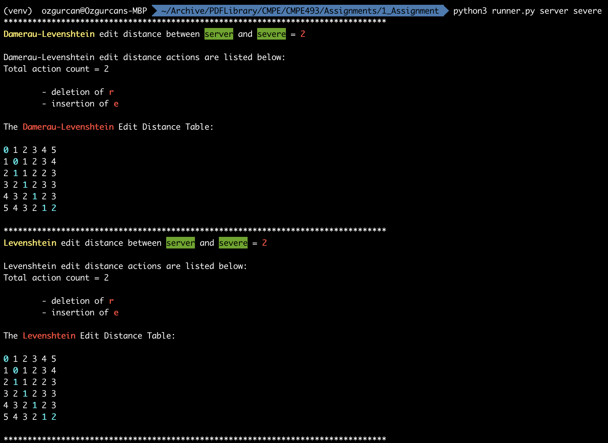
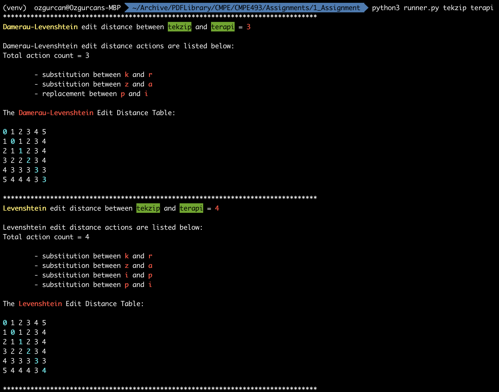

# <span style="color:red">CMPE 493: Introduction to Information Retrieval Fall 2020</span>
# <span style="color:orange">README for Assignment 1</span>

## <span style="color:green">Introduction: </span>
This project has been given to me to understand and comprehend the edit distance algorithms between two words. The implementations on this assignment belongs to me and me only. It can get upgraded by any open source contributor under the rules of BSD 3-Clause License.

## <span style="color:green">How To Run: </span>
To run the program, CLI is needed and one external library have been utilized to achieve the output with a greater user experience.

<span style="color:pink">List of external libraries used and why:</span>

1. <span style="color:red">termcolor</span>: To colorize the path on the edit distance table and several outputs to express the information with a better way.

<span style="color:pink">List of built-in libraries used and why:</span>

1. <span style="color:red">sys</span>: To read input from CLI 

Source Code Language: <span style="color:yellow">Python3</span>

Version & Platform: <span style="color:yellow">3.8.6 (64-bit)</span>

## <span style="color:red">BEWARE:</span> This assignment has been designed to utilize user experience to at its best, <span style="color:red">thus there's a few seconds that the program installs a virtual environment and downloads & installs packages for visual upgrade.</span> The actual time spent to calculate both edit distances is very optimal. Time data can be observed at the end of the output of a run.

## <span style="color:orange">An example usage of the running sequence:</span>
```bash
./entry.sh <word_1> <word_2>
```

## <span style="color:green">Example Inputs and Outputs: </span>

1. `prefer` and `purify`


2. `server` and `severe`


3. `tekzip` and `terapi`

