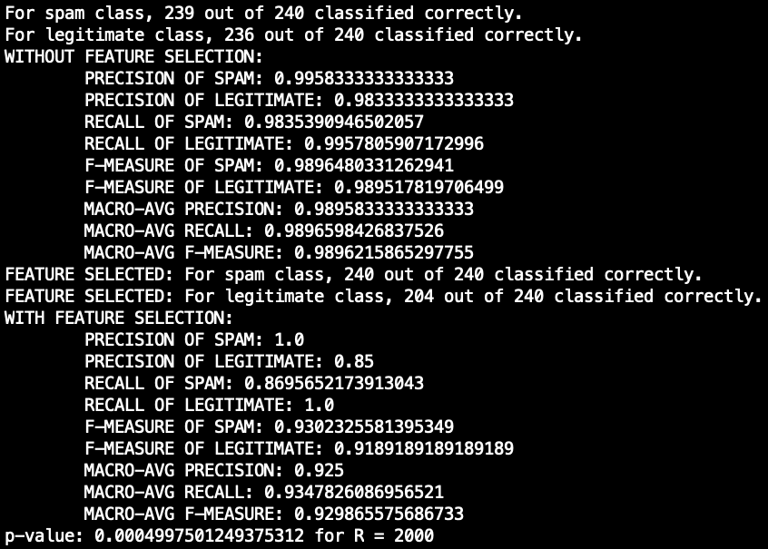

# <span style="color:red">CMPE 493: Introduction to Information Retrieval Fall 2020</span>
# <span style="color:orange">Report for Assignment 4</span>

## <span style="color:green">Introduction:</span>
This project has been given to me to understand the Naive Bayes approach and mutual information concepts

## <span style="color:green">How To Run:</span>
To run the program, CLI is needed and no external library have been utilized.

Version & Platform: <span style="color:yellow">3.8.6 (64-bit)</span>

### - Put the dataset folder in here.

### - After then, run the script:

```bash
./entry.sh
```

This should output entire evaluation, with our without feature selection.

## <span style="color:green">Questions - Answers:</span>
- What is the size of your vocabulary when you use all words as features?
    - Complete vocabulary size: 14193 unique words, total occurences: 129720 times

- Report the k most discriminating words (where k = 100) for each class based on Mutual Information.
    - ['language', '$', 'free', 'remove', 'linguistic', 'http', 'com', 'check', 'money', 'linguist', 'linguistics', 'university', 'market', 'site', 'cost', 'best', 'click', 'business', 'our', '0', 'internet', 'product', 'service', 'mail', 'company', 'english', 'today', 'advertise', 'million', 'day', '100', 'www', 'home', 'cash', 'sell', 'hour', 'win', 'dollar', 'pay', 'bulk', 'web', 'call', 'card', 'query', 'save', 'income', 'credit', 'mailing', 'success', 'us', 'offer', 'guarantee', 'easy', 'thousand', 'purchase', 'hundred', 'yours', 'earn', 'department', 'customer', 'instruction', 'edu', 'name', 'over', 'yourself', 'speaker', 'reference', 'anywhere', 'address', 'online', 'grammar', 'want', 'visit', 'order', '800', 'theory', 'zip', 'phone', 'receive', 'need', '24', 'buy', 'profit', 'line', 'every', 'personal', 'price', 'syntax', 'here', 'return', 'step', '10', '1998', 'science', 'list', '1', 'per', '20', 'email', 'website']

- Report the macro-averaged precision, recall, and F-measure values obtained by the two versions of your classifier on the test set, as well as the performance values obtained for each class separately by using Laplace smoothing with α= 1.
    - WITHOUT FEATURE SELECTION:
	    - PRECISION OF SPAM: 0.9958333333333333
	    - PRECISION OF LEGITIMATE: 0.9833333333333333
	    - RECALL OF SPAM: 0.9835390946502057
	    - RECALL OF LEGITIMATE: 0.9957805907172996
	    - F-MEASURE OF SPAM: 0.9896480331262941
	    - F-MEASURE OF LEGITIMATE: 0.989517819706499
	    - MACRO-AVG PRECISION: 0.9895833333333333
	    - MACRO-AVG RECALL: 0.9896598426837526
	    - MACRO-AVG F-MEASURE: 0.9896215865297755
    - WITH FEATURE SELECTION:
	    - PRECISION OF SPAM: 1.0
	    - PRECISION OF LEGITIMATE: 0.85
	    - RECALL OF SPAM: 0.8695652173913043
	    - RECALL OF LEGITIMATE: 1.0
	    - F-MEASURE OF SPAM: 0.9302325581395349
	    - F-MEASURE OF LEGITIMATE: 0.9189189189189189
	    - MACRO-AVG PRECISION: 0.925
	    - MACRO-AVG RECALL: 0.9347826086956521
	    - MACRO-AVG F-MEASURE: 0.929865575686733

- Perform randomization test to measure the significance of the difference between the macro-averaged  F-scores  of  the  two  versions  of  your  classifier  (i.e.,  without  feature selection and with feature selection).
    - Significance of the difference between two models: 0.059756010843042495

- Screenshot:
    
